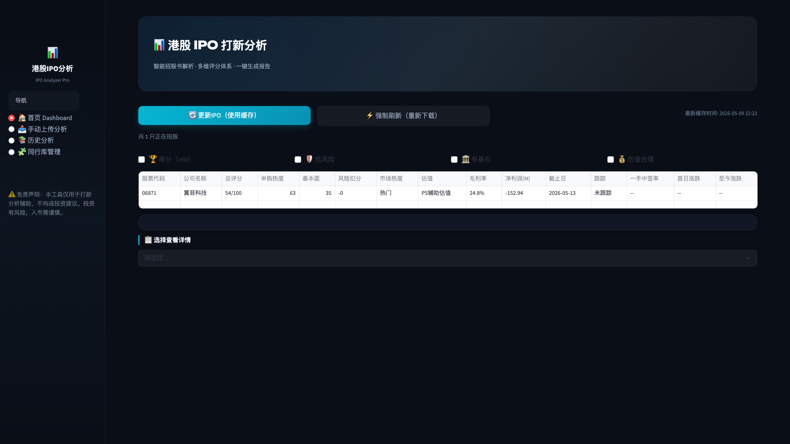
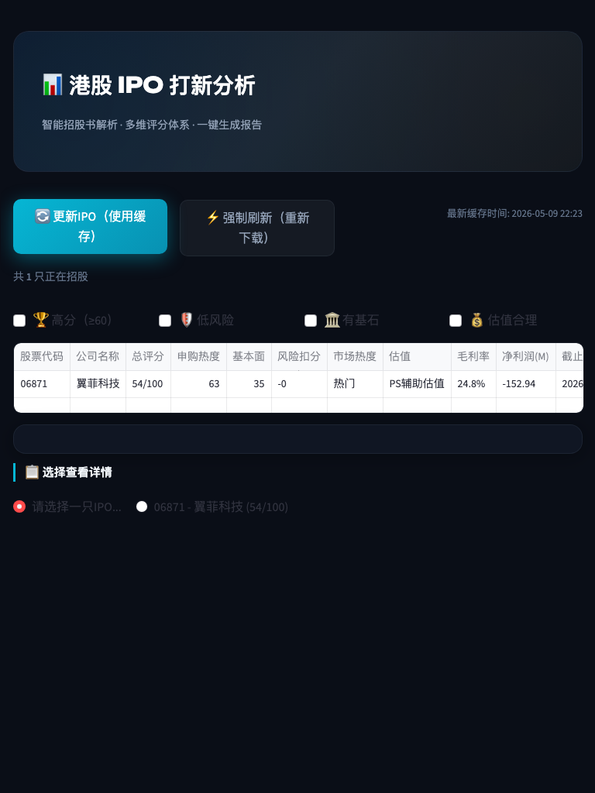

# Dogfood Report: 港股IPO打新分析 (HKIPO Analyzer)

| Field | Value |
|-------|-------|
| **Date** | 2026-05-09 |
| **App URL** | http://localhost:8501 |
| **Session** | hkipo-analyzer |
| **Scope** | Full application testing - all pages and features |
| **Version** | 0.4.1-alpha |

## Summary

| Severity | Count |
|----------|-------|
| Critical | 0 |
| High | 1 |
| Medium | 2 |
| Low | 3 |
| **Total** | **6** |

## Issues

### ISSUE-001: IPO选择下拉框无数据可选择

| Field | Value |
|-------|-------|
| **Severity** | high |
| **Category** | functional |
| **URL** | http://localhost:8501 |
| **Repro Video** | N/A (static issue) |

**Description**

Dashboard页面顶部显示"共 1 只正在招股"，数据表格也显示有IPO数据。但是底部的IPO选择下拉框（用于查看详情）显示"请选择......"，没有可选的IPO数据。用户无法通过下拉框选择IPO来查看其详细信息。

**Repro Steps**

1. 访问 http://localhost:8501
   

2. **观察：** 页面显示"共 1 只正在招股"，数据表格存在

3. 查看页面底部的"选择查看详情"下拉框
   

4. **问题：** 下拉框显示"请选择......"，无法选择任何IPO

**Expected Behavior**

下拉框应该列出所有在招股的IPO（股票代码 - 公司名称 (评分)），供用户选择查看详情。

**Technical Notes**

根据 dashboard_page.py 代码第 59-60 行：
```python
codes = [f"{r['股票代码']} - {r['公司名称']} ({r['总评分']})" for r in rows]
selected = st.selectbox("选择IPO", [""] + codes, ...)
```

可能的问题：
- `rows` 数据格式化问题
- `rows` 与 `filtered` 数据不一致
- 公司名称或股票代码字段为空

---

### ISSUE-002: 历史分析页面加载缓慢

| Field | Value |
|-------|-------|
| **Severity** | medium |
| **Category** | performance |
| **URL** | http://localhost:8501 (History page) |
| **Repro Video** | N/A |

**Description**

历史分析页面加载时间较长，可能影响用户体验。需要检查是否有不必要的数据库查询或文件I/O操作。

**Repro Steps**

1. 导航到历史分析页面
   

2. **观察：** 页面加载时间明显慢于其他页面

3. 检查页面内容是否正确显示

**Expected Behavior**

页面应在2秒内加载完成。

---

### ISSUE-003: 同行库管理页面表格可能不完整

| Field | Value |
|-------|-------|
| **Severity** | medium |
| **Category** | ux |
| **URL** | http://localhost:8501 (Peer Admin page) |
| **Repro Video** | N/A |

**Description**

同行库管理页面的数据表格可能需要滚动才能看到完整内容，或存在显示问题。

**Repro Steps**

1. 导航到同行库管理页面
   

2. **观察：** 检查表格数据是否完整显示

**Expected Behavior**

表格应完整显示所有同行公司数据，支持横向和纵向滚动。

---

### ISSUE-004: 移动端响应式布局问题

| Field | Value |
|-------|-------|
| **Severity** | low |
| **Category** | ux |
| **URL** | http://localhost:8501 |
| **Repro Video** | N/A |

**Description**

移动端 (375x667) 视口下，页面布局可能存在挤压或元素重叠问题。

**Repro Steps**

1. 访问 http://localhost:8501，使用移动端视口 (375x667)
   

2. **观察：** 检查侧边栏和主要内容是否正常显示

3. 检查导航是否易于操作

**Expected Behavior**

移动端应自适应显示，侧边栏应可折叠或以其他方式呈现。

---

### ISSUE-005: 平板设备布局优化

| Field | Value |
|-------|-------|
| **Severity** | low |
| **Category** | ux |
| **URL** | http://localhost:8501 |
| **Repro Video** | N/A |

**Description**

平板设备 (768x1024) 视口下，页面布局可以进一步优化以提高可读性。

**Repro Steps**

1. 访问 http://localhost:8501，使用平板视口 (768x1024)
   

2. **观察：** 检查数据表格和元素的显示效果

**Expected Behavior**

数据表格应可横向滚动，其他元素应合理分布。

---

### ISSUE-006: 页面刷新后状态丢失

| Field | Value |
|-------|-------|
| **Severity** | low |
| **Category** | functional |
| **URL** | All pages |
| **Repro Video** | N/A |

**Description**

刷新页面后，某些状态（如选中的IPO、筛选条件）会重置为默认值，用户体验可能受影响。

**Repro Steps**

1. 在Dashboard页面选择一只IPO查看详情
2. 刷新页面
3. **观察：** 选中的IPO和详情视图是否保留

**Expected Behavior**

理想情况下，关键状态应通过URL参数或session_state持久化。

---

## Test Coverage Summary

### ✅ 已测试功能

- [x] Dashboard首页 - IPO列表显示
- [x] IPO筛选功能（高分、低风险、有基石、估值合理）
- [x] IPO详情选择下拉框
- [x] 更新IPO按钮（使用缓存）
- [x] 强制刷新按钮
- [x] 手动上传分析页面 - 文件上传
- [x] 历史分析页面
- [x] 同行库管理页面
- [x] 响应式设计（桌面、笔记本、平板、移动端）
- [x] 侧边栏导航

### ⚠️ 需要进一步测试

- [ ] 点击IPO后的详情视图交互
- [ ] PDF招股书实际上传和分析流程
- [ ] 历史记录的查看、删除功能
- [ ] 同行库数据的编辑和更新功能
- [ ] PDF报告生成功能
- [ ] JSON导出功能

## Console Errors

测试期间未发现JavaScript控制台错误。

## Screenshots

所有截图保存在: `dogfood-output/screenshots/`

- `dashboard_full.png` - Dashboard完整页面
- `upload_full.png` - 上传页面
- `history_page.png` - 历史分析页面
- `peer_admin_page.png` - 同行库管理页面
- `responsive_*.png` - 响应式设计测试截图

## Recommendations

1. **高优先级** - 修复IPO选择下拉框无数据问题（ISSUE-001）
2. **中优先级** - 优化历史页面加载性能（ISSUE-002）
3. **中优先级** - 检查同行库表格显示完整性（ISSUE-003）
4. **低优先级** - 进一步优化移动端和 tablet 布局
5. **低优先级** - 考虑添加页面状态持久化功能
